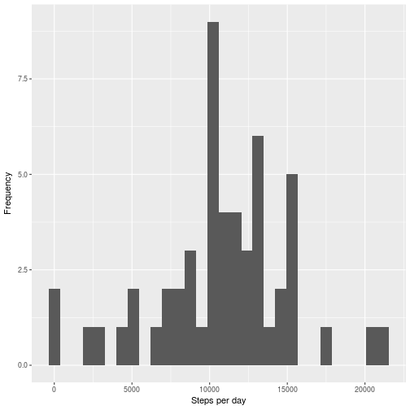
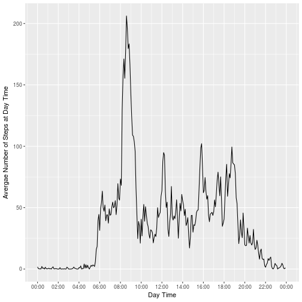
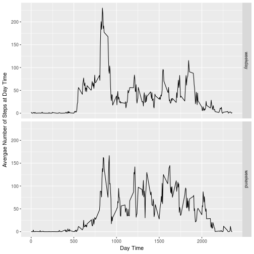

## Loading and preprocessing the data

1. unzip data

```r
unzip("activity.zip")
```

2. read as CSV

```r
data <- read.csv("activity.csv")
```

3. convert date variable

```r
data$date <- as.Date(data$date)
```


## What is mean total number of steps taken per day?
For this part of the assignment, you can ignore the missing values in the dataset.

1. Calculate the total number of steps taken per day

```r
steps_perday <- filter(data, !is.na(date) & !is.na(steps)) %>%  group_by(date) %>% summarise(steps = sum(steps)) 
```
2. Make a histogram of the total number of steps taken each day

```r
qplot(steps_perday$steps, geom = "histogram", ylab = "Frequency", xlab = "Steps per day") 
```

```
## `stat_bin()` using `bins = 30`. Pick better value with `binwidth`.
```



3. Calculate and report the mean and median of the total number of steps taken per day


```r
filter(data, !is.na(date) & !is.na(steps) ) %>%  group_by(date) %>% summarise_each(funs(mean, median), steps)
```

```
## # A tibble: 53 × 3
##          date     mean median
##        <date>    <dbl>  <dbl>
## 1  2012-10-02  0.43750      0
## 2  2012-10-03 39.41667      0
## 3  2012-10-04 42.06944      0
## 4  2012-10-05 46.15972      0
## 5  2012-10-06 53.54167      0
## 6  2012-10-07 38.24653      0
## 7  2012-10-09 44.48264      0
## 8  2012-10-10 34.37500      0
## 9  2012-10-11 35.77778      0
## 10 2012-10-12 60.35417      0
## # ... with 43 more rows
```

## What is the average daily activity pattern?
1. Make a time series plot (i.e. type = "l") of the 5-minute interval (x-axis) and the average number of steps taken, averaged across all days (y-axis) 


```r
averageinterval_perday         <- filter(data, !is.na(date) & !is.na(steps)) %>%  
                                  group_by(interval) %>% 
                                  summarise(steps = mean(steps))

averageinterval_perday$daytime <- as.POSIXct('2000-01-01 00:00:00', tz="GMT") + 
                                    ((averageinterval_perday$interval %/% 100) * 3600) + 
                                    ((averageinterval_perday$interval %% 100) * 60) 

xlim_p3 <- as.POSIXct(c(min(averageinterval_perday$daytime), 
                        max(averageinterval_perday$daytime) + 300), 
                        origin="2000-01-01", tz="GMT")

with(averageinterval_perday, 
      qplot(daytime, steps, geom = "line",  
             ylab = "Avergae Number of Steps at Day Time", xlab = "Day Time" ) +
      scale_x_datetime(breaks = date_breaks("2 hour"), 
                  minor_breaks=date_breaks("1 hour"), 
                  labels=date_format("%H:%M"), limits = xlim_p3))
```



2. Which 5-minute interval, on average across all the days in the dataset, contains the maximum number of steps?

```r
max_step <- averageinterval_perday[order(averageinterval_perday$steps, decreasing = TRUE),][1,]
format(max_step$daytime, "%H:%M")
```

```
## [1] "08:35"
```


## Imputing missing values
1. Calculate and report the total number of missing values in the dataset (i.e. the total number of rows with NAs)

```r
sum(rowSums(is.na(data)) > 0) 
```

```
## [1] 2304
```
2. Devise a strategy for filling in all of the missing values in the dataset. The strategy does not need to be sophisticated. For example, you could use the mean/median for that day, or the mean for that 5-minute interval, etc.

```r
na_step <- is.na(data$steps) 
```
3. Create a new dataset that is equal to the original dataset but with the missing data filled in.

```r
data_non_na <- data 
data_non_na[is.na(data_non_na$steps), "steps"] <- averageinterval_perday$steps
```

4. Make a histogram of the total number of steps taken each day and Calculate and report the mean and median total number of steps taken per day. Do these values differ from the estimates from the first part of the assignment? What is the impact of imputing missing data on the estimates of the total daily number of steps?


```r
avg_perday_imput <- filter(data_non_na, !is.na(date) & !is.na(steps)) %>%  
                                  group_by(interval) %>% 
                                  summarise(steps = mean(steps))

qplot(steps_perday$steps, geom = "histogram", ylab = "Frequency", xlab = "Steps per day") 
```

```
## `stat_bin()` using `bins = 30`. Pick better value with `binwidth`.
```


```r
filter(data_non_na, !is.na(date) & !is.na(steps) ) %>%  group_by(date) %>% summarise_each(funs(mean, median), steps)
```

```
## # A tibble: 61 × 3
##          date     mean   median
##        <date>    <dbl>    <dbl>
## 1  2012-10-01 37.38260 34.11321
## 2  2012-10-02  0.43750  0.00000
## 3  2012-10-03 39.41667  0.00000
## 4  2012-10-04 42.06944  0.00000
## 5  2012-10-05 46.15972  0.00000
## 6  2012-10-06 53.54167  0.00000
## 7  2012-10-07 38.24653  0.00000
## 8  2012-10-08 37.38260 34.11321
## 9  2012-10-09 44.48264  0.00000
## 10 2012-10-10 34.37500  0.00000
## # ... with 51 more rows
```


## Are there differences in activity patterns between weekdays and weekends?
1. Create a new factor variable in the dataset with two levels – “weekday” and “weekend” indicating whether a given date is a weekday or weekend day.

```r
data_non_na$wd <- weekdays(data_non_na$date)
data_non_na[data_non_na$wd ==  "Saturday" | data_non_na$wd ==  "Sunday",]$wd <- "weekend" 
data_non_na[data_non_na$wd !=  "weekend" ,]$wd <- "weekday" 
data_non_na$wd <- as.factor(data_non_na$wd)
```
2. Make a panel plot containing a time series plot (i.e. type = "l") of the 5-minute interval (x-axis) and the average number of steps taken, averaged across all weekday days or weekend days (y-axis). See the README file in the GitHub repository to see an example of what this plot should look like using simulated data.

```r
avg_perweekday_imput <- group_by(data_non_na, interval, wd) %>% 
                                     summarise(steps = mean(steps))

avg_perweekday_imput$daytime <- as.POSIXct('2000-01-01 00:00:00', tz="GMT") + 
                                    ((avg_perweekday_imput$interval %/% 100) * 3600) + 
                                    ((avg_perweekday_imput$interval %% 100) * 60) 

 qplot(interval, steps, data = avg_perweekday_imput, geom = "line",  
             ylab = "Avergae Number of Steps at Day Time", xlab = "Day Time", facets = wd ~ . ) 
```


